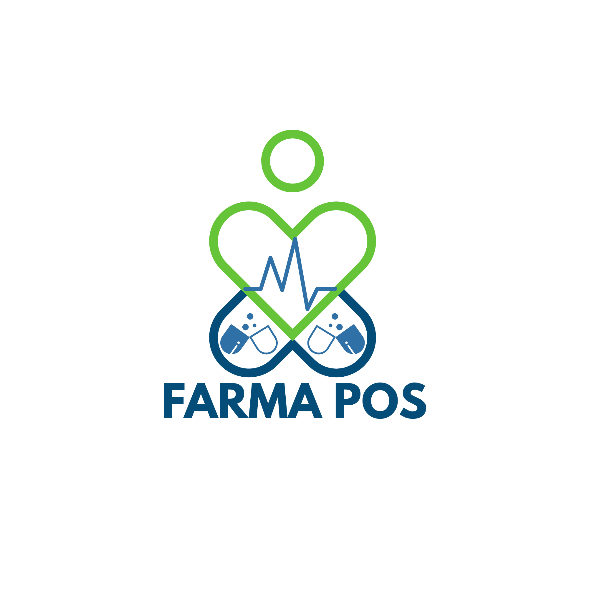

<!DOCTYPE html>
<html lang="es">
<head>
<meta charset="UTF-8">
<meta name="viewport" content="width=device-width, initial-scale=1.0">
<title>Lanzamiento | FarmaPOS Cloud</title>
<link rel="preconnect" href="https://fonts.googleapis.com">
<link rel="preconnect" href="https://fonts.gstatic.com" crossorigin>
<link href="https://fonts.googleapis.com/css2?family=Poppins:wght@300;400;500;600;700;800&display=swap" rel="stylesheet">
<link href="https://cdn.jsdelivr.net/npm/bootstrap@5.3.3/dist/css/bootstrap.min.css" rel="stylesheet">
<link href="https://cdn.jsdelivr.net/npm/bootstrap-icons@1.11.3/font/bootstrap-icons.css" rel="stylesheet">

</head>
<body>

  

    

      <a class="brand-shell" href="#inicio">
        
        

          
FarmaPOS Cloud

          
Presentacion comercial

        

      </a>
    

    

      <nav class="nav-pill">
        <a href="#beneficios">Beneficios</a>
        <a href="#precios">Cotizacion</a>
        <a href="#requisitos">Requisitos</a>
        <a href="#faq">FAQ</a>
        <a href="#contacto">Contacto</a>
      </nav>
    

  

  <section class="hero" id="inicio">
    

      

        
<i class="bi bi-stars"></i> Presentacion comercial

        <h1>FarmaPOS Cloud plataforma de gestion farmaceutica en la nube.</h1>
        
FarmaPOS Cloud es una solucion disenada para optimizar la gestion operativa de farmacias mediante una plataforma centralizada, accesible y adaptable a diferentes entornos de trabajo.

        
Esta pagina presenta una vision general de la propuesta comercial, enfocada en facilitar la comprension del servicio, sus beneficios y su estructura operativa.

        

          <a class="btn btn-brand" href="#precios"><i class="bi bi-file-earmark-text"></i> Ver estructura</a>
          <a class="btn btn-glass" href="#contacto"><i class="bi bi-chat-dots"></i> Contacto comercial</a>
        

        

          
<i class="bi bi-check2-circle"></i>Informacion clara y sin promesas no confirmadas.

          
<i class="bi bi-check2-circle"></i>Condiciones sujetas a validacion tecnica y operativa.

          
<i class="bi bi-check2-circle"></i>Estructura preparada para cotizacion personalizada.

        

        

          
<strong>Cotizacion</strong>Definida segun necesidades reales del negocio.

          
<strong>Validacion</strong>Tecnica y operativa antes de implementacion.

          
<strong>Presentacion</strong>Orientada a toma de decisiones comerciales.

        

      

      

        <aside class="float-panel" id="precios">
          

            

              
Importante

              <h2 class="h3 mt-2 mb-0">Condiciones sujetas a validacion</h2>
            

            
<i class="bi bi-info-circle-fill"></i> Cotizacion formal

          

          

            
Cotizacion

            
$89.900 / mes

            
El valor mensual de referencia es de $89.900. El valor final puede variar segun numero de usuarios, cantidad de sedes, nivel de implementacion requerido, necesidades operativas especificas y alcance del soporte.

            

              
Implementacion<strong>Segun operacion</strong>

              
Valor mensual<strong>$89.900</strong>

              
Soporte<strong>Segun acuerdo</strong>

            

          

          
Los valores, condiciones y alcance del servicio estan sujetos a validacion previa y deben confirmarse mediante una cotizacion formal basada en las necesidades reales del negocio.

        </aside>
      

    

  </section>

  <section class="trust-strip">
    

      
Estructura del servicio

      

        
<strong>Implementacion</strong>Configuracion segun operacion, parametrizacion inicial y validacion previa.

        
<strong>Licenciamiento</strong>Definido segun modelo comercial acordado y propuesta formal.

        
<strong>Soporte</strong>Nivel de soporte definido por acuerdo comercial.

        
<strong>Presentacion</strong>Vision general del servicio, sus beneficios y estructura operativa.

      

    

  </section>
  <section class="section-block" id="beneficios">
    

      
Enfoque comercial

      <h2>Presentacion profesional orientada a toma de decisiones</h2>
      
Esta propuesta esta construida bajo un enfoque transparente y verificable.

    

    

      
<article class="feature-card">
<i class="bi bi-shield-check"></i>
<h3>Enfoque responsable</h3>
El contenido evita promesas no verificadas y presenta la informacion de forma clara y profesional.
</article>

      
<article class="feature-card">
<i class="bi bi-palette2"></i>
<h3>Imagen comercial solida</h3>
Diseno moderno orientado a generar confianza y mejorar la percepcion del servicio.
</article>

      
<article class="feature-card">
<i class="bi bi-diagram-3"></i>
<h3>Mejor organizacion</h3>
Estructura clara que facilita la comprension de condiciones, requisitos y alcance del servicio.
</article>

      
<article class="feature-card">
<i class="bi bi-phone"></i>
<h3>Adaptabilidad</h3>
Compatible con escritorio, tablet y movil.
</article>

    

  </section>

  <section class="section-block">
    

      
Esquema comercial de referencia

      <h2>Categorias de referencia para cotizacion</h2>
      
Los siguientes niveles son categorias de referencia y no representan precios finales.

    

    

      
<article class="plan-card">Referencia
<i class="bi bi-rocket-takeoff"></i>
<h3>Referencia Base</h3>
Para configuraciones iniciales.

$89.900 / mes
<ul><li>Alcance por definir</li><li>Implementacion segun proyecto</li><li>Condiciones segun validacion</li></ul></article>

      
<article class="plan-card featured">Referencia
<i class="bi bi-people"></i>
<h3>Referencia Multiusuario</h3>
Para operaciones con mayor volumen.

Cotizacion segun alcance
<ul><li>Usuarios y sedes a validar</li><li>Soporte segun acuerdo</li><li>Implementacion segun proyecto</li></ul></article>

      
<article class="plan-card">Referencia
<i class="bi bi-buildings"></i>
<h3>Referencia Personalizada</h3>
Para necesidades especificas o multiples sedes.

Cotizacion personalizada
<ul><li>Alcance definido en propuesta formal</li><li>Condiciones segun validacion</li><li>Implementacion segun proyecto</li></ul></article>

    

  </section>

  <section class="section-block">
    

      

        

          

            
Comparativa comercial

            <h2 class="mb-0">Comparativa comercial de referencia</h2>
          

        

      

      

        <table class="compare-table">
          <thead>
            <tr>
              <th>Aspecto</th>
              <th class="text-center">Base</th>
              <th class="text-center">Multiusuario</th>
              <th class="text-center">Personalizado</th>
            </tr>
          </thead>
          <tbody>
            <tr>
              <td>Licenciamiento</td>
              <td class="center">Segun cotizacion</td>
              <td class="center">Segun cotizacion</td>
              <td class="center">Segun cotizacion</td>
            </tr>
            <tr>
              <td>Usuarios/Sedes</td>
              <td class="center">A validar</td>
              <td class="center">A validar</td>
              <td class="center">A validar</td>
            </tr>
            <tr>
              <td>Soporte</td>
              <td class="center">Segun acuerdo</td>
              <td class="center">Segun acuerdo</td>
              <td class="center">Segun acuerdo</td>
            </tr>
            <tr>
              <td>Implementacion</td>
              <td class="center">Segun proyecto</td>
              <td class="center">Segun proyecto</td>
              <td class="center">Segun proyecto</td>
            </tr>
          </tbody>
        </table>
      

    

  </section>

  <section class="section-block" id="requisitos">
    

      
Requisitos

      <h2>Requisitos referenciales</h2>
      
Los requisitos tecnicos y operativos deben validarse antes de la puesta en marcha definitiva.

    

    

      
<article class="req-card">
<i class="bi bi-pc-display"></i>
<h3>Tecnicos</h3><ul><li>Equipo de escritorio o portatil</li><li>Navegador actualizado</li><li>Conexion a internet</li><li>Perifericos segun operacion</li></ul></article>

      
<article class="req-card">
<i class="bi bi-briefcase"></i>
<h3>Operativos</h3><ul><li>Informacion inicial del negocio</li><li>Datos administrativos y comerciales</li><li>Responsable del proyecto</li><li>Disponibilidad para validacion</li></ul></article>

    

  </section>

  <section class="section-block" id="faq">
    

      
FAQ

      <h2>Preguntas frecuentes</h2>
      
Las respuestas siguientes aclaran el enfoque comercial y las condiciones de validacion de la propuesta.

    

    

      
<article class="faq-card"><h3>El precio ya esta definido?</h3>
La pagina muestra un valor mensual de referencia de $89.900. Las condiciones finales deben confirmarse mediante cotizacion formal segun el alcance del servicio.
</article>

      
<article class="faq-card"><h3>Los requisitos son definitivos?</h3>
No necesariamente. Se confirman en la validacion previa.
</article>

      
<article class="faq-card"><h3>Los planes son finales?</h3>
No. Son referencias comerciales, no propuestas cerradas.
</article>

      
<article class="faq-card"><h3>Que falta para publicacion final?</h3>
Definir precios reales, confirmar condiciones, incluir contactos oficiales y validar alcance del servicio.
</article>

    

  </section>

  <section class="section-block" id="contacto">
    <article class="cta-card text-center text-lg-start">
      

        

          <h2>FarmaPOS Cloud presenta una propuesta estructurada, clara y adaptable.</h2>
          
Esta landing esta disenada como una base comercial solida, lista para ser completada con informacion validada y utilizada en entornos reales de negocio.

          

            
<i class="bi bi-check2-circle"></i>Solicitud de propuesta comercial.

            
<i class="bi bi-check2-circle"></i>312 794 7484.

            
<i class="bi bi-check2-circle"></i>Canales de contacto del negocio.

          

        

        

          

            <a class="btn btn-brand" href="mailto:farmapos_sft@gmail.com"><i class="bi bi-envelope-fill"></i> farmapos_sft@gmail.com</a>
            <a class="btn btn-glass" href="tel:+573127947484"><i class="bi bi-telephone-fill"></i> 312 794 7484</a>
          

        

      

    </article>
  </section>

  
&copy; 2026 FarmaPOS Cloud. Landing comercial de lanzamiento.

</body>
</html>

